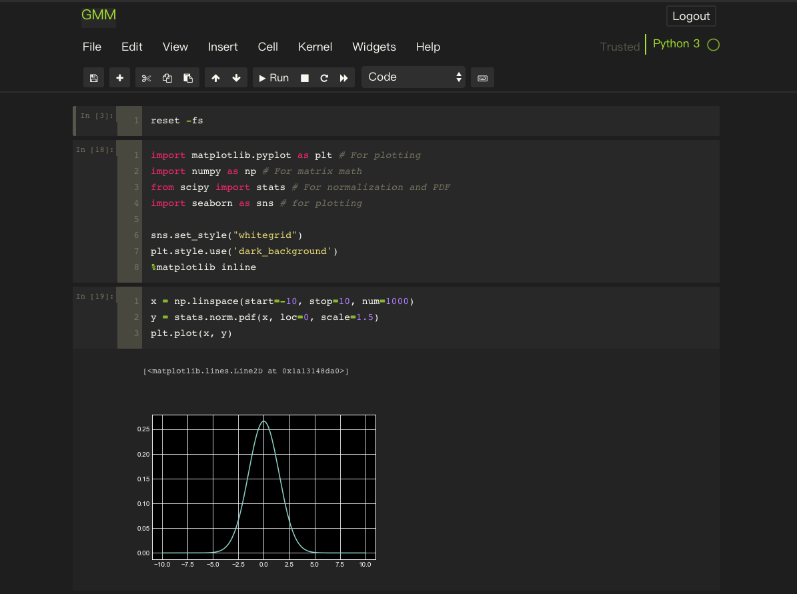

[The Jupyter Notebook](http://jupyter.org/) is an open-source web application that allows you to create and share documents that contain live code, equations, visualizations and narrative text.  It is widely used in machine learning, data visualization, data mining and so on.

This article is to share my Jupyter configuration and will be updated continuously.

<!--more-->

## Get Started

If you are new in Jupiter, you can follow this [quick tutorial](https://jupyter-notebook-beginner-guide.readthedocs.io/en/latest/index.html) to get started.

## Theme

After installing and running Jupyter I find that the default theme is light. As a developer who works almost all day long in front of the screen, I am not a fan of light theme because the light theme easily makes eyes exhausted. So the very first thing is to change the theme to dark:

1. Install  [`jupyter-themes`](https://github.com/dunovank/jupyter-themes)  using `pip` : 

   ~~~shell
   $ pip install jupyterthemes
   ~~~

   of using `conda`:

   ~~~shell
   $ conda install jupyterthemes
   ~~~

2. Change theme

   ~~~shell
   $ jt -t <theme-name>
   ~~~

   Available themes:

   + onedork
   + grade3
   + oceans16
   + chesterisch
   + monokai
   + solarizedl
   + solarizedd

   Since I am a big fan of [Sublime](https://www.sublimetext.com/), I set monokai as my Jupyter's theme. And this is what it looks like:

   

###  (Possible) Problems after changing theme

#### 1. Header and toolbar disappear

1. Open a file
2. Click **View**
3. Click **Toogle Header** and **Toogle Toolbar**

#### 2. The axis and its coordinates are poorly visible when using `matplotlib` to plot a graph

Use the ``dark_background`` sytle for `matplotlib` 

~~~python
import matplotlib.pyplot as plt
plt.style.use('dark_background')
~~~

You can also use [`seaborn`](https://seaborn.pydata.org/):

1. Install `seaborn`

   ~~~shell
   $ pip install seaborn
   ~~~

2. Import and use it

   ~~~python
   import seaborn as sns
   ~~~

#### 3. The cell output is missing the first two characters in each row

This issue is caused by the CSS style and can be easily fixed by changing the CSS style of the output area.

1. Go to the `custom.css`

   ~~~shell
   $ open ~/.jupyter/custom/custom.css
   ~~~

2. Replace the current div.output_area with the following in the custom css file

   ~~~Css
   div.output_area {
       display: -webkit-box;
       padding: 13px;
   }
   ~~~

## Extensions

[**jupyter_contrib_nbextensions**](https://github.com/ipython-contrib/jupyter_contrib_nbextensions) provides us a lot of useful plugins.

1. Install using `pip`

   ~~~shell
   $ pip install jupyter_contrib_nbextensions
   ~~~

   or using `conda`

   ~~~shell
   $ conda install -c conda-forge jupyter_contrib_nbextensions
   ~~~

2. Install JavaScript and Css files

   ~~~shell
   $ jupyter contrib nbextension install --user
   ~~~

3. Enable/Disable extensions

   ~~~shell
   $ jupyter nbextension enable <nbextension require path>
   ~~~

   For example,

   ~~~shell
   $ jupyter nbextension enable codefolding/main
   ~~~

   **Alternatively**, and more conveniently, you can use the [jupyter_nbextensions_configurator](https://github.com/Jupyter-contrib/jupyter_nbextensions_configurator) server extension, which is installed as a dependency of this repo, and can be used to enable and disable the individual nbextensions, as well as configure their options. 

Some of my enabled extensions:

+ Hinterland (for auto-completing)
+ Collapsible header
+ Codefolding

## Have fun!

