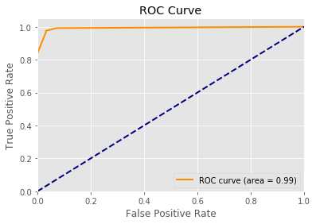

Binary classification is a typical application of machine learning. We use the dataset to train a model, and use this model to predict positive or negative result given an unknown sample. How good (accurate) is the model? We need to evaluate it!
But wait, how can we evaluate a binary classification model? Use which criterions? 

<!--more-->

## The Confusion Matrix

In binary classification, the **truth (actual value)** has two classes:

+ actual positive (The truth is that this is actually true) 
+ actual negative (The truth is that this is actually false)

And the model's **prediction (predicted value)** also has two classes:

+ Predicted positive (Our model says this is true)
+ Predicted condition negative (Our model says this is false)

Therefore we can generate four ($2 \cdot 2$) combination of the prediected and actual values: 

+ **True Positive (TP)**: Prediction says positive, and the truth is also positive -> Prediction correct
+ **False Positive (FP)**: Prediction says positive, but the truth is actually negative -> Prediction wrong
+ **True Negative (TN)**: Prediction says negative, but the truth is also negative -> Prediction correct
+ **False Negative (FN)**: Prediction says negative, but the truth is actually negative -> Prediction correct

You may be already crazy. "What the F\*\*K is this??? It is goddamn confused!". Don't worry, You are not the one who feels confused. So the matrix which describes these four classes is named the **Confusion Matrix**:


Well, this matrix looks way better than the description. 

To memorize these four classes, you can use this trick:

+ Firstly look at the **second** word: *positive/negative*. This word is the prediction result.
+ Then look at the **first** word: *true/false*:
  + If the prediction matches the truth, then the prediction is correct. --> true
  + If the prediction doesn't match the truth, then the prediction is wrong. --> false

Still confused? Look at the image below:


+ Square outside: the actual value
  + left: actual positive
  + right: actual negative

+ Oval in the middle: the prediction value is positive

Still not intuitive enough? Ok, let's look at the pregnancy analogy:


+ **TP**: You predicted that a woman is pregnant and she actually is.
+ **FP (Type 1 Error)**: You predicted that a man is pregnant but he actually is not.
+ **TN**: You predicted that a man is not pregnant and he actually is not.
+ **FN (Type 2 Error)**: ou predicted that a woman is not pregnant but she actually is.


## Metric for Evaluation


+ **True Positive Rate (TPR)**

  $TPR = \frac{TP}{P} = \frac{TP}{TP + FN}$

+ **True Negative Rate (TNR)**: Out of all the (actual) negative classes, how much we predicted correctly.

  $TNR = \frac{TN}{N} = \frac{TN}{FP + TN}$

+ **[False Positive Rate (FPR)](https://en.wikipedia.org/wiki/False_positive_rate)**

  $FP = \frac{FP}{FP + TN} = 1 - TNR$

+ **False Negative Rate(FNR)**

  $FNR = \frac{FN}{FN + TP} = 1 - TPR$

> Remember: denominator is the actual class!
>
> Take True Negative Rate (TNR) for instance:
>
> + in this case, the numerator is True Negative (TN)
> + the denominator is the actual negative class (No matter we predicted it as positive or negative)
>
> You can understand it like "Out of all the classes which are actullay negative, how much we predicted correctly (the prediction says it is also negative)", or "the ratio that we have made a correct prediction for the classes which are actually negative"

+ **Accuracy (ACC)**

  $ACC = \frac{TP + TN}{P + N} = \frac{TP + TN}{TP + FP + FN + TN}$

+ **Recall**: Out of all the (actual) positive classes, how much we predicted correctly. It should be high as possible. 

  $Recall = \frac{TP}{TP + FN} = TPR$

+ **Precision**: Out of all the (prediction) positive classes, how much we predicted correctly. It should be high as possible.

  $Precision = \frac{TP}{TP + FP}$


It is difficult to compare two models with low precision and high recall or vice versa. So to make them comparable, we use [F-Score](https://en.wikipedia.org/wiki/F1_score). **F-score (also F1-score, F-measure)** helps to measure Recall and Precision at the same time. It uses Harmonic Mean in place of Arithmetic Mean by punishing the extreme values more.

$F_{1} = 2 \cdot \frac{precision \cdot recall}{precision + recall}  $

 It is a special case of the general $F_{\beta}$ measure (for non-negative real values of $\beta$):

$F_{\beta} = (1 + \beta ^ {2}) \cdot \frac{precision \cdot recall}{precision + recall}$

$\beta$ is the emphasis on precision or recall 

$\beta = \frac{Weight_{recall}}{Weight_{precision}}$

+ $\beta \lt 1$: put more emphasis on precision than recall ($Weight_{precision} > Weight_{recall}$)
+ $\beta = 1$: precision is as important as recall ($Weight_{precision} = Weight_{recall}$)
+ $\beta \gt 1$: weight recall higher than precision ($Weight_{precision} < Weight_{recall}$)


## Receiver Operating Characteristic (ROC)

Now we have metrics and criterions to evaluation a binary classification model. But is there a way that we can directly and intuitively visualize the model's performance instead of calculating and comparing? 
Yep, you got it! Ladies and gentlemen, let me introduce you, **AUC** (**Area Under The Curve**) **ROC** (**Receiver Operating Characteristics**) curve. It is one of the most important evaluation metrics for checking any classification model’s performance. It is also written as **AUROC** (**Area Under the** **Receiver Operating Characteristics**).

### What is AUC-ROC Curve?

AUC - ROC curve is a **performance measurement for classification problem at various thresholds settings**. 

+ ROC is a probability curve
+ AUC represents degree or measure of separability. It tells how much model is capable of distinguishing between classes. **Higher the AUC, better the model is at predicting 0s as 0s and 1s as 1s.** By analogy, Higher the AUC, better the model is at distinguishing between patients with disease and no disease. ()

The ROC curve is plotted with TPR against the FPR where 

+ TPR (also Recall, Sensitivity) is on y-axis
+ FPR ($ = 1 - \text{Specificity} = 1 - TPR$) is on the x-axis.
+ Specifity $= \frac{TN}{TN + FP} = TNR$


### How is the ROC Curve being plotted?

We plot a ROC curve by by connecting several ROC points. Everytime we adjust the threshold, we have new TPR and FPR, which means we have a new ROC point.

Assume that we have calculated sensitivity and specificity values from multiple confusion matrices for four different threshold values.

| Threshold | Sensitivity (TPR) | Specificity (TNR) | 1 – specificity (FPR) |
| --------- | ----------------- | ----------------- | --------------------- |
| 1         | 0.0               | 1.0               | 0.0                   |
| 2         | 0.5               | 0.75              | 0.25                  |
| 3         | 0.75              | 0.5               | 0.5                   |
| 4         | 1.0               | 0.0               | 1.0                   |

We first added four points that matches with the pairs of sensitivity and specificity values and then connected the points to create a ROC curve.


### How to Speculate the Performance of the Model?

> Note: In the graph below, red distribution curve is of the positive class (patients with disease) and green distribution curve is of negative class(patients with no disease).

An excellent model has AUC near to the **1** which means it has good measure of separability.

Which means, it predicts 0s as 0s and 1s as 1s.

<center class="half">
    
    
</center>

This is an ideal (perfect) situation. When two curves don’t overlap at all means model has an ideal measure of separability. It is perfectly able to distinguish between positive class and negative class.

But we can not achieve the ideal situation every time. It is normal that these two distributions have overlap.

<center class="half">


</center>

When two distributions overlap, we introduce type 1 (FP) and type 2 error (FN). Depending upon the threshold, we can minimize or maximize them. When AUC is 0.7, it means there is 70% chance that model will be able to distinguish between positive class and negative class.

When AUC is **0.5**, it means model has no class separation capacity whatsoever (Random situation). This is a classifier with the random performance level.

<center class="half">


</center>

When AUC is approximately 0, model is actually reciprocating the classes. It means, model is predicting negative class as a positive class and vice versa.

<center class="half">


</center>

### **Relation between Sensitivity, Specificity, FPR and Threshold.**

**Sensitivity and Specificity are inversely proportional to each other.** So when we increase Sensitivity, Specificity decreases and vice versa.

+ Sensitivity⬆️, Specificity⬇️ 

  When we decrease the threshold, we get more positive values thus it increases the sensitivity and decreasing the specificity.

+ Sensitivity⬇️, Specificity⬆️

  When we increase the threshold, we get more negative values thus we get higher specificity and lower sensitivity.

As we know $FPR = 1 - TNR = 1 - specificity$. So when we increase TPR (Sensitivity), FPR also increases and vice versa (Sensitivity⬆️, Specificity⬇️, (1 - Specificity)⬆️).

**Therefore, the conclusion is:**

+ **Sensitivity⬆️, Specificity⬇️, FPR⬆️**

+ **Sensitivity⬇️, Specificity⬆️, FPR⬇️**

### ROC curves for multiple models

Comparison of multiple classifiers is usually straight-forward especially when no curves cross each other. Curves close to the perfect ROC curve have a better performance level than the ones closes to the baseline. (The closer to the ideal/perfect ROC, the higher the AUC)


### Small Visualization Tool 

http://www.navan.name/roc/


## Plot ROC Curve using Python

In [3]:

~~~python
from sklearn.datasets import make_classification
from sklearn.linear_model import LogisticRegression
from sklearn.model_selection import train_test_split

# Binary Classification
X, y = make_classification(n_samples=1000, n_features=4, n_classes=2)

X_train, X_test, y_train, y_test = train_test_split(X, y, test_size=0.25, random_state=1)

from sklearn.neighbors import KNeighborsClassifier

model = KNeighborsClassifier()
model.fit(X_train, y_train)

y_predict = model.predict(X_test)
~~~

In [4]:

```python
from sklearn.metrics import confusion_matrix

confusion_matrix(y_test, y_predict)
```

Out[4]:

```
array([[122,   4],
       [  4, 120]])
```

In [5]:

```python
from sklearn.metrics import roc_curve, auc
import matplotlib.pyplot as plt
plt.style.use('ggplot')
%matplotlib inline

y_predict_probabilities = model.predict_proba(X_test)[:,1]

fpr, tpr, _ = roc_curve(y_test, y_predict_probabilities)
roc_auc = auc(fpr, tpr)

plt.figure()
plt.plot(fpr, tpr, color='darkorange',
         lw=2, label='ROC curve (area = %0.2f)' % roc_auc)
plt.plot([0, 1], [0, 1], color='navy', lw=2, linestyle='--')
plt.xlim([0.0, 1.0])
plt.ylim([0.0, 1.05])
plt.xlabel('False Positive Rate')
plt.ylabel('True Positive Rate')
plt.title('ROC Curve')
plt.legend(loc="lower right")
plt.show()
```




## Reference

+ [Understanding Confusion Matrix](https://towardsdatascience.com/understanding-confusion-matrix-a9ad42dcfd62)
+ [Understanding AUC - ROC Curve](https://towardsdatascience.com/understanding-auc-roc-curve-68b2303cc9c5)
+ [Introduction to the ROC (Receiver Operating Characteristics) plot](https://classeval.wordpress.com/introduction/introduction-to-the-roc-receiver-operating-characteristics-plot/)
+ [Scoring Classifier Models using scikit-learn](http://benalexkeen.com/scoring-classifier-models-using-scikit-learn/)

+ Wikipedia